# Notify Mobile App

Notify is a modern note taking app, developed as a solution for problem statement given by Govt. of Puducherry in Smart India Hackathon 2020. This app is built in Flutter which makes it executable on both Android and iOS platform from a single codebase.

## Technology Stack
- Flutter (Dart)
- Java
- Firebase (Firestore)

## Features
- Create/Update/Delete note
- Categorise notes into notebook
- Create/Update/Delete notebook
- Floating widget running in backgroud, displaying over other apps
- Floating widget to take screenshot from any app
- Convert image captured to text using OCR before adding to note
- Add bookmark to note
- Assign Tag to note
- Search note by tags
- Assign label to notebook
- Markdown editor to edit note
- Add image to note
- Edit image(doodle, add text, add filter, add emoji) before adding to note
- Realtime Backup of user data
- Generate and share a link of note
- Authentication
- Simple and interactive UI

## App preview

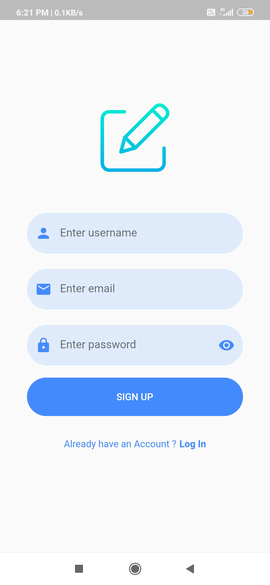
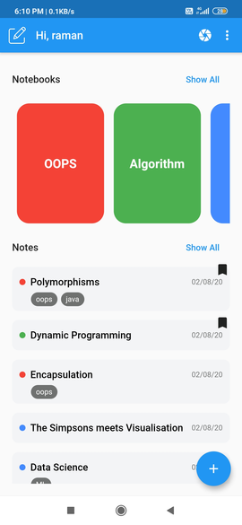
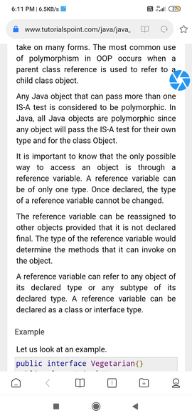
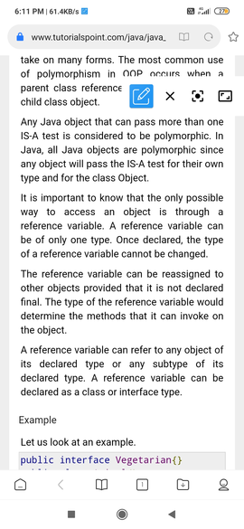
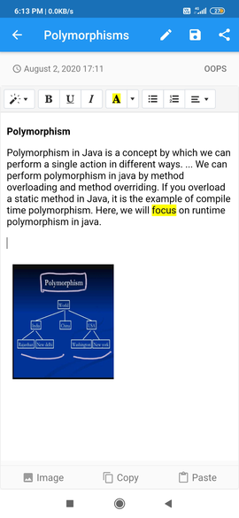
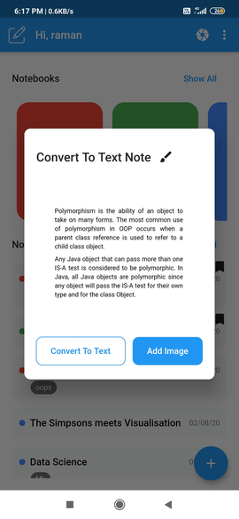

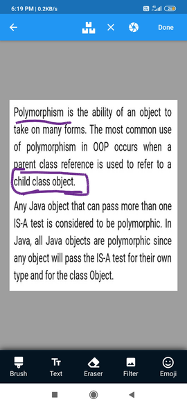
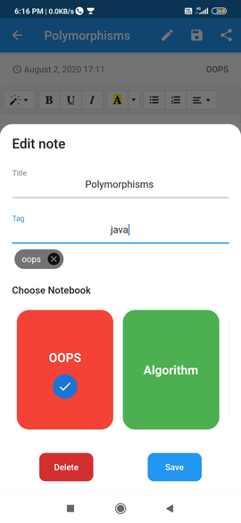
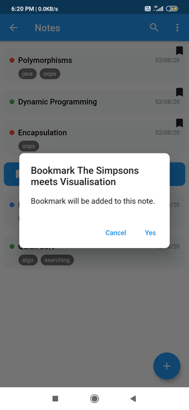

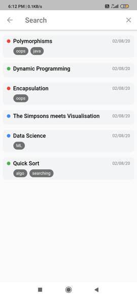
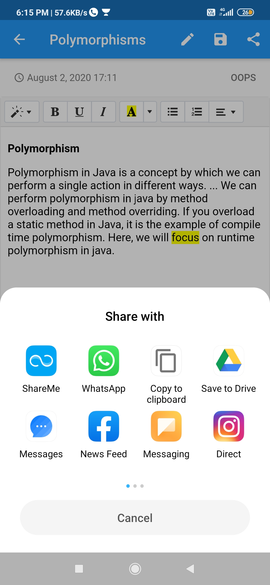

## Installation

- Add [Flutter](https://flutter.dev/docs/get-started/install) to your machine

- Open this project folder with Terminal/CMD and run `flutter packages get`

- Run `flutter run` to build and run the debug app on your emulator/phone

## New To Flutter
A few resources to get you started if this is your first time in flutter:

- [Lab: Write your first Flutter app](https://flutter.dev/docs/get-started/codelab)
- [Cookbook: Useful Flutter samples](https://flutter.dev/docs/cookbook)

For help getting started with Flutter, view our
[online documentation](https://flutter.dev/docs), which offers tutorials,
samples, guidance on mobile development, and a full API reference.

